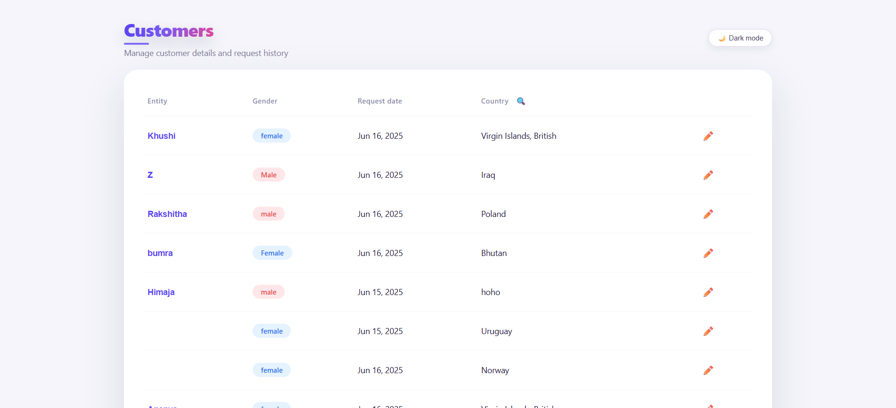
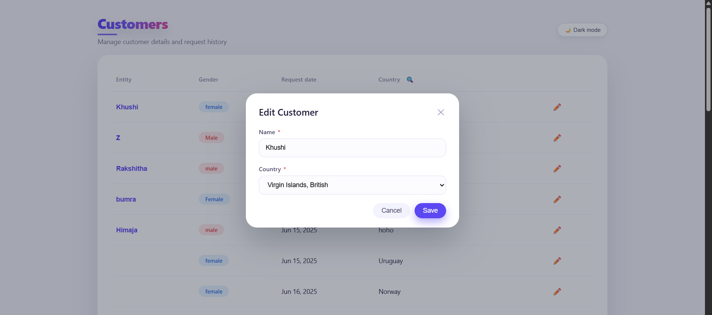
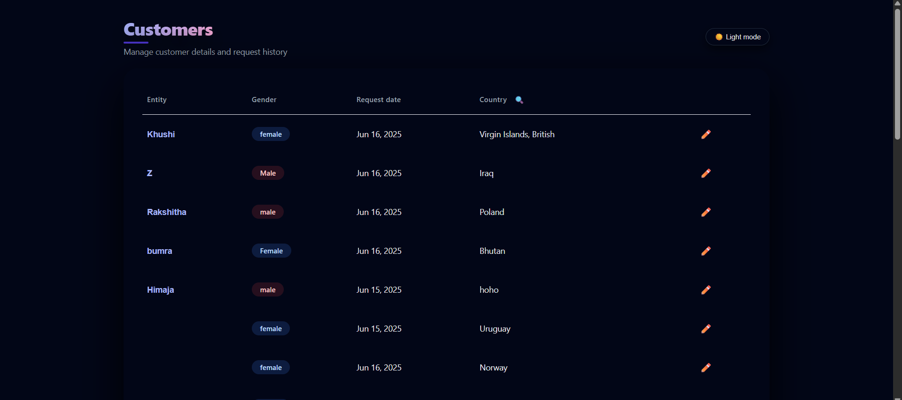

# 📌 Inkle Frontend Intern Assignment – Customer Management UI

This repository contains my submission for the **Inkle Frontend Intern Assignment**.  
It is built using **React (TypeScript)** and follows the provided **Figma design** closely while implementing all functional requirements such as table rendering, filtering, and editing customers.

I also added **dark mode**, an enhanced header, and overall UI polish for a smoother experience.

---

## 🚀 Live Demo

🔗 **Live App:**https://inkle-frontend-intern-assignment-cu.vercel.app/

---

## 📸 Final Application Preview

---

# 🧱 Tech Stack

- **React + TypeScript**
- **Vite**
- **TanStack Table**
- **REST API Integration**
- **Custom CSS Styling**
- **React Hooks (useState, useEffect, useMemo)**

---

# 🎯 Features Implemented

## ✅ 1. Customer Table (TanStack Table)

- Displays all customer details:
  - **Entity (Name)**
  - **Gender (pills)**
  - **Request Date** (formatted using `createdAt`)
  - **Country**
  - **Edit Action**
- Clean spacing, shadows, borders, and typography based on the Figma design.
- Hover states and smooth transitions for better UX.

---

## ✅ 2. Multi-Select Country Filter

- Filter icon in the “Country” column header.
- Opens a popover with checkbox list of countries.
- Allows selecting multiple countries at once.
- Includes a **Clear** button to reset filters.
- Closes automatically on clicking outside.
- Accurate Figma-inspired design.

---

## ✅ 3. Edit Customer Modal

- Opens when clicking the edit icon.
- Editable fields:
  - **Name** (entity)
  - **Country**
- PUT request updates customer data.
- Local table updates automatically.
- Clean modal styling, backdrop, and responsive layout.
- Validation and saving indicator.

---

## ✅ 4. Request Date Handling

The API does **not** include a `request_date` field.

👉 I used `createdAt` instead, converting it to a readable date:

**Example:**  
`2025-06-16T09:51:53.484Z` → **Jun 16, 2025**

This maintains consistency with the Figma UI while using available API data.

---

# ⭐ Additional Enhancements (Above Requirements)

### 🌙 Dark Mode Support

- Theme toggle button in the header.
- Full dark theme for:
  - Table
  - Modal
  - Buttons
  - Text
  - Filter popover
- Smooth transitions and visual clarity.

### 🎨 Upgraded Page Header

- Gradient-style **“Customers”** title.
- Accent underline bar.
- Subtitle matching the tone of a real dashboard:
  - *“Manage customer details and request history”*

### 🧼 General UI Polish

- Rounded card UI.
- Shadows and depth.
- Subtle animations throughout the UI.
- Careful spacing and typography system.

---

